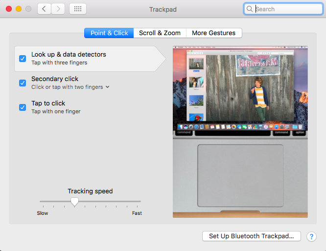
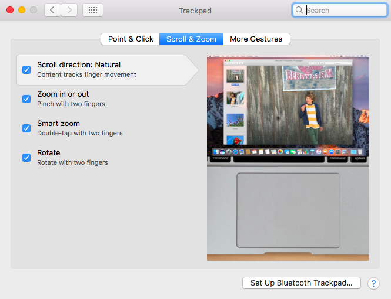
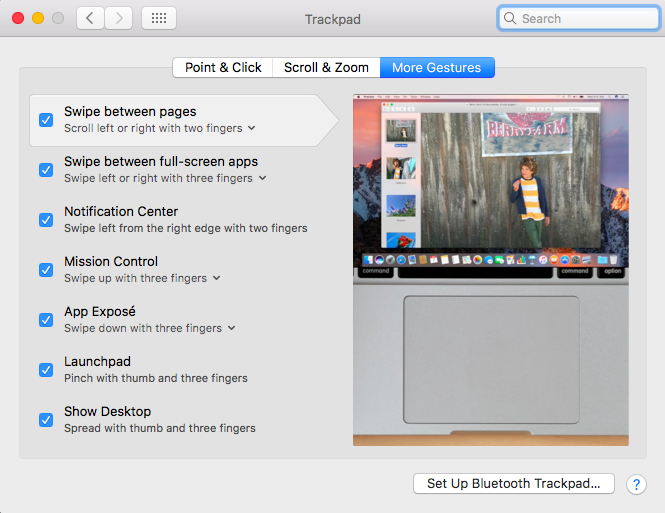
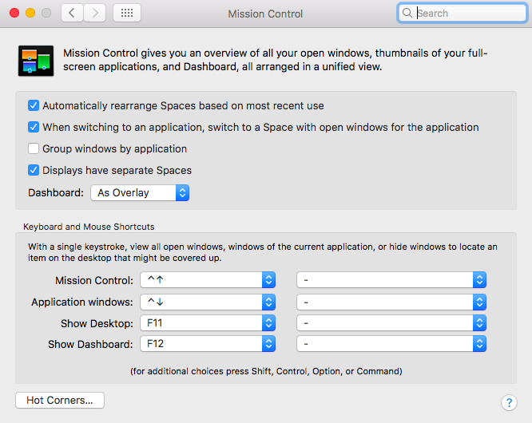
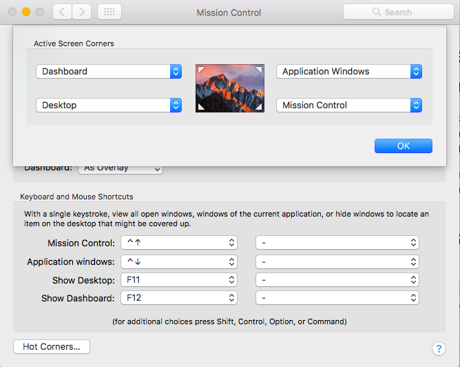
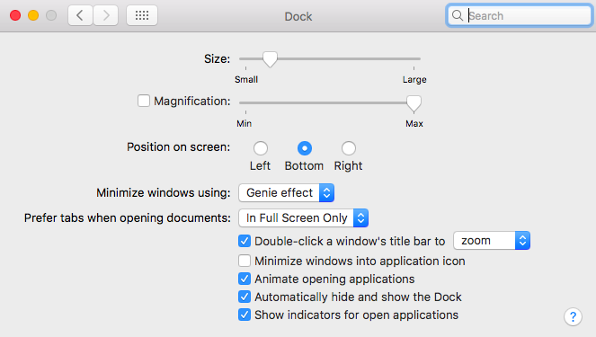
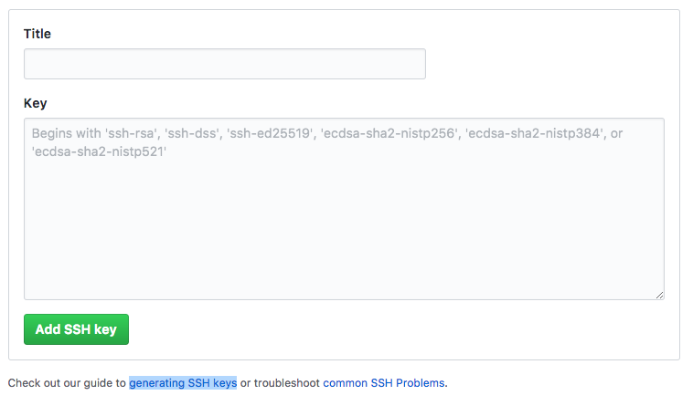

# Setting Up A Development Environment on Mac OS

For work, I primarily use Python 3.x, R and occasionally Python 2.x. The toolset includes Jupyter Notebooks, R-Studio, Sublime Text, MySQL, MongoDB and Redis, MacDown, and a few others. 

These are some of the steps I have taken in the recent past to setup a development environment on my Macbook, running **MacOS Sierra**. Most of it is through trial and error, and the generosity of [StackOverflow](http://stackoverflow.com) users.

## General System Setup
### Trackpad Options

### Mission Control Options

### Hot Corners

### Dock Preferences

## Alternative to Terminal: iTerm2
There's nothing fundamentally wrong with **Terminal**, but I do enjoy the ability to open a tab instead of a window, which is something **iTerm2** provides me. Of course, other developers might have many other reasons to prefer one over the other, but for me it was down to this very minor issue. 
You can download it from [iTerm2's website](http://www.iterm2.com/). There are multiple versions available for download, and I always opt for the **stable release**. 

## Homebrew
**[Homebrew](http://brew.sh/)** just makes installing, managing and updating packages so much easier. There are others such as **MacPorts**, but I have grown used to **Homebrew**, and haven't looked at other options for quite some time now.
### Requirements
From [Github](https://github.com/Homebrew/brew/blob/master/docs/Installation.md):

* An Intel CPU 1
* OS X 10.10 or higher 2
* Command Line Tools (CLT) for Xcode: xcode-select --install, developer.apple.com/downloads or Xcode 3
* A Bourne-compatible shell for installation (e.g. bash or zsh) 4

### Installing
Paste this into your terminal/iTerm2/Command Line Interface (henceforth **iTerm2**):

	/usr/bin/ruby -e "$(curl -fsSL https://raw.githubusercontent.com/Homebrew/install/master/install)"

In the earlier versions of Homebrew, perhaps one had to go through the process of setting up Xcode Command Line Tools as well. In my recent clean install, I only entered the above command, and Homebrew also downloaded and installed Command Line Tools for me.

In case that is not true for you, you can install it with entering `xcode-select --install` in **iTerm2**.

After installation, we need to add `/usr/local/bin` to the `$PATH` environment variable by executing the following script in **iTerm2**:

    echo 'export PATH="/usr/local/bin:$PATH"' >> ~/.bash_profile

And you can read a good explanation of what that means on this [link](https://rkulla.blogspot.com/2014/03/the-path-to-homebrew.html).

Restart iTerm2 after that, and then run these two commands, and run them often.

    brew update
    brew doctor

### Usage
Typical syntax for usage is as follows:

    brew install package_name
    

## Git
The instructions here are tailored for **Github**, so if you use **Bitbucket** or **Gitlab**, you might have to hunt around for more appropriate instructions. Also, all instructions assume you have a working Github account.
Let's begin by installing git with the following command:

    brew install git

Next, confirm that it has installed correctly, by calling the `which git` command, which should give you the response `/usr/local/bin/git`.

Then, we configure the system to work with **Github**.

	git config --global user.name "Firstname Lastname"
	git config --global user.email 	"user@email.com"
	
These have to be the **same as your registered name and email on Github**. Next, go to "Settings" in your Github account, select SSH and GPG keys, and click on "New SSH Key".

Now, on your iTerm2, execute the following:

	ssh-keygen -t rsa -b 4096 -C "your_email@example.com"
	
Next, enter a file name, or simply press enter:
	
	Enter a file in which to save the key (/Users/you/.ssh/id_rsa): [Press enter]
	
Enter a password:

	Enter passphrase (empty for no passphrase): [Type a passphrase]
	Enter same passphrase again: [Type passphrase again]
	
Start the ssh-agent in the background:
	
	eval "$(ssh-agent -s)"

Add your SSH key to the ssh-agent	:
	
	ssh-add -K ~/.ssh/id_rsa
	
Copy the key to your clipboard:

	pbcopy < ~/.ssh/id_rsa.pub
	
And finaly, paste the key to Github page you have opened, and enter an identifier for your computer in the space named 'Title'.

And finally, execute these commands to exclude the `.DS_Store` files.

	git config --global core.excludesfile ~/.gitignore
	echo *.DS_Store >> ~/.gitignore
You are all set to use Github.

## Python 2.x and 3.x
Execute the next set of commands in iTerm2, to setup Python 2 and 3, along with iPython/Jupyter notebooks. 

	brew tap caskroom/cask
	brew install brew-cask-completion
	
	brew install python
	brew install python3
	
	brew tap Homebrew/python
	brew install numpy --with-python3
	
	brew install scipy --with-python3
	brew install zeromq --with-python3
	
	pip install jinja2, tornado, pyzmq, matplotlib
	pip3 install jinja2, tornado, pyzmq, matplotlib
	
	ARCHFLAGS=-Wno-error=unused-command-line-argument-hard-error-in-future pip install pandas
	pip3 install pandas
	
	pip install ipython
	pip3 install ipython
	
	pip install jupyter
	pip3 install jupyter
	
## Virtualenv

[Virtualenv](http://www.virtualenv.org/) creates an isolated Python environments for each project.

Different projects can be maintained in their respective folders, a bit like keeping cats and dogs in their own enclosures away from each other.
### Installing

Execute the following line in iTerm2:

    pip install virtualenv
    pip3 install virtualenv
    
## MySQL

### Installing

Run the following line in **iTerm2**:

    brew install mysql
    
Also, as a best practice, I tend to always run `brew update` and `brew doctor` before and after any major installations.

### Usage

To start **MySQL Server**, run the following command:

    mysql.server start
    
To stop it, run:

    mysql.server stop
    

### MySQL Workbench

There are many tools for this, but I prefer **MySQL Workbench** as a GUI tool. You can download this from this [link](https://www.mysql.com/products/workbench/).

## Redis
As per Wikipedia, **[Redis](https://redis.io/)** is an open-source software project that implements data structure servers. It is networked, in-memory, and stores keys with optional durability.

### Installing

Run the following command:

    $ brew install redis

    
## MongoDB

**[MongoDB](https://www.mongodb.com/)** is a free and open-source cross-platform document-oriented database program. Classified as a **NoSQL** database program, MongoDB uses **JSON-like documents with schemas**.

### Installing

Run the following command:

    $ brew install mongo

## R
Of course, **R** is available via **[CRAN](https://cran.r-project.org/)**. However, I have noticed that installing it via CRAN, and adding **R-Studio** causes many issues with Homebrew. 
Follow the steps below to install R via Homebrew:

	brew cask install xquartz
	brew tap homebrew/science
	brew install ‐‐with‐x11 r
	brew cask install ‐‐appdir=/Applications rstudio
	
This will install R with XQuartz support, followed by installing R Studio with a copy of the application in the Applications folder.

## MacDown
**[MacDown](https://macdown.uranusjr.com/)** is an open source **Markdown** editor for macOS, released under the MIT License. Install with the following command:
	
	brew cask install macdown.